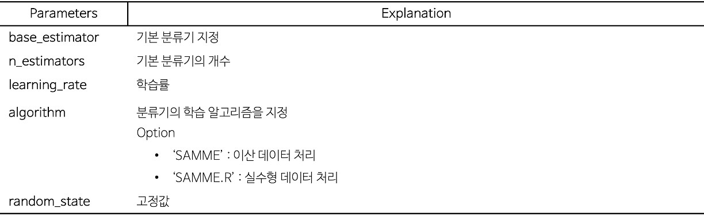
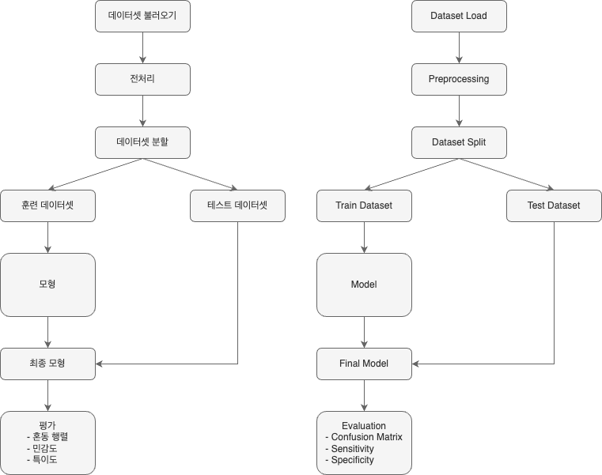
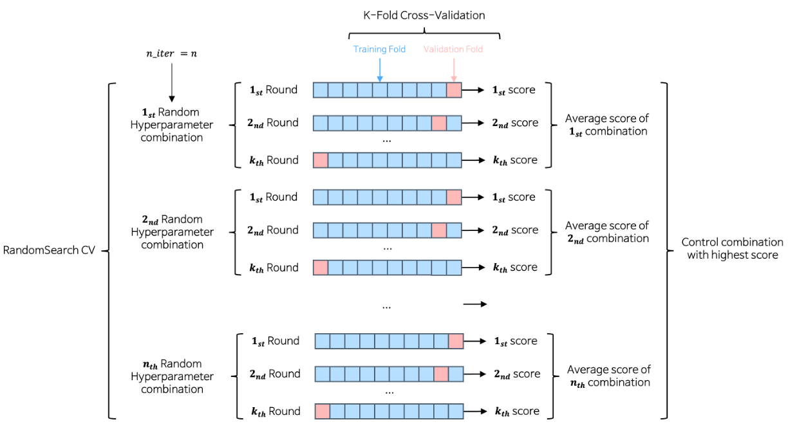
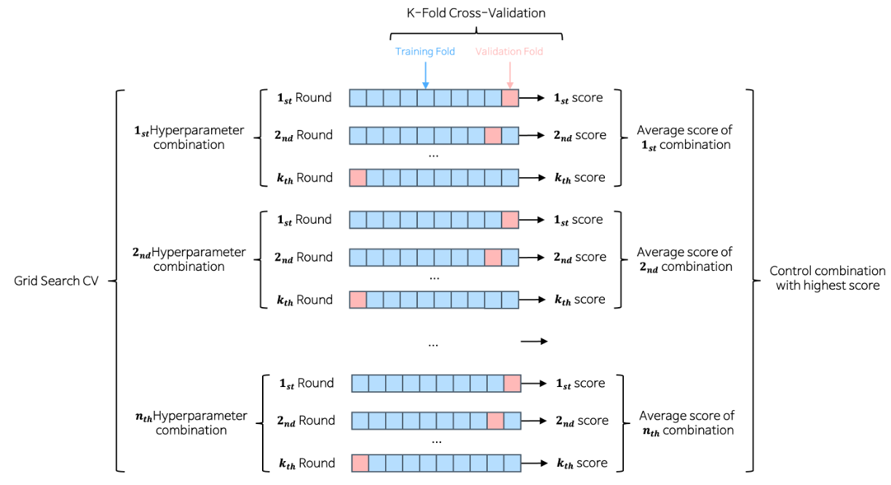
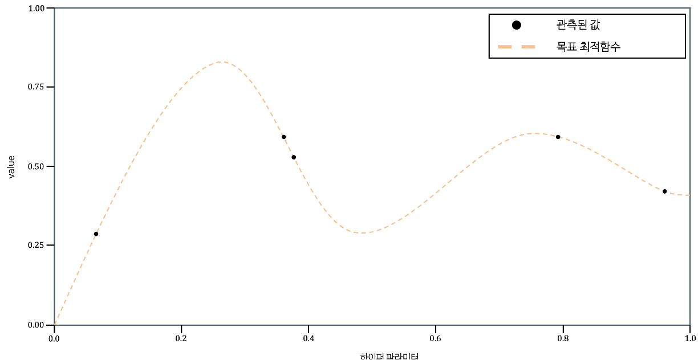
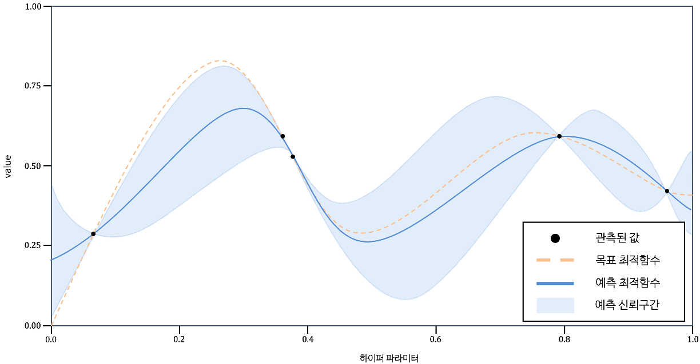
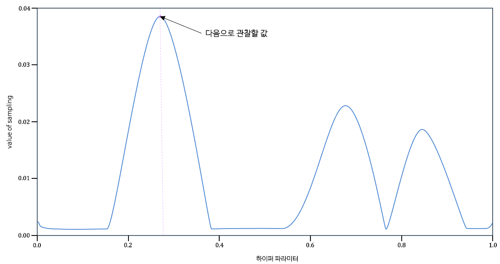
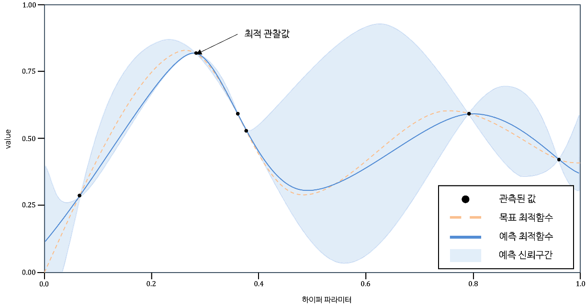

---
title : "AdaBoost"
format :
    html:
        code-fold : False
        toc : true
        toc-title : "Contents"
        toc-location : left

jupyter : python3
---
<span style = "color : blue">Create. Seung-Ho Ryu (Comment. Jung-In Seo)</span>

<details>
    <summary>Reference</summary>

- 파이썬 머신러닝 완벽 가이드(4-5)

</details>
**< 실습 데이터셋 >**

- Titanic 데이터 셋 : 타이타닉 사건(1912년도) 때 타이타닉 호에 탑승했던 승객들의 정보, 생존 여부등으로 총 11개의 Feature로 이루어져 있습니다.
    - 11개의 변수 중 분석에 사용할 변수는 아래의 표에서 소개를 합니다.



- Flow Chart


# Data Preprocessing 
import pandas as pd
import numpy as np
from sklearn.model_selection import train_test_split, cross_val_score, StratifiedKFold
from sklearn.preprocessing import StandardScaler, LabelEncoder

# Visualization 
import seaborn as sns
import matplotlib.pyplot as plt

# warning ignore 
import warnings
warnings.filterwarnings(action = 'ignore')

# Model Definition
from sklearn.ensemble import AdaBoostClassifier

# Search 범위 설정
from scipy.stats import uniform

# Search Define
from sklearn.model_selection import RandomizedSearchCV, GridSearchCV
from skopt import BayesSearchCV                                        # BayesSearch(skopt library)

# Evaluation
from sklearn.metrics import roc_curve, accuracy_score, confusion_matrix, roc_auc_score
# 1. 데이터 불러오기
# 데이터 불러오기
titanic = pd.read_csv('./Data/Titanic.csv')

titanic
# 2. 전처리
# 가족 변수 추가
titanic['FamSize'] = titanic['SibSp'] + titanic['Parch']  # FamSize = 형제 및 배우자 수 + 부모님 및 자녀 수

# 분석에 사용할 변수만 선택
Use_Columns = ['Survived', 'Pclass', 'Sex', 'Age', 'FamSize', 'Fare', 'Embarked']  
titanic = titanic[Use_Columns] 

# 결측값 행 제거
titanic.dropna(subset = ['Age'], axis = 0, inplace = True)

# 변수 형태 변경
titanic[['Survived', 'Pclass', 'Sex', 'Embarked']] = titanic[['Survived', 'Pclass', 'Sex', 'Embarked']].astype('category')
titanic['Age'] = titanic['Age'].astype('int')

# One-Hot-Encoding
titanic = pd.get_dummies(titanic, columns = ['Pclass', 'Sex', 'Embarked'], drop_first = True)
# 3. 데이터 탐색
# 변수 형태
titanic.info()
# 수치형 변수 시각화
def numberic_plot(df, target):
    g = sns.PairGrid(df, hue = target)  # 주어진 데이터 컬럼에 대한 모든 조합을 만들어주는 빈 틀을 위한 코드        
    g.map_diag(sns.histplot)            # 삼각행렬의 중간 부분
    g.map_lower(sns.scatterplot)        # 아래 부분
    
    # 상관 계수 행렬을 구하고 상관 계수 값 표시
    corr_matrix = df.corr()
    for i, j in zip(*plt.np.triu_indices_from(g.axes, k = 1)):                                        # np.triu_indices_from : 삼각행렬의 위쪽 삼각형의 인덱스 (k = 0 : 대각 행렬 포함, 1 : 제외)
        g.axes[i, j].annotate(f"corr : {corr_matrix.iloc[i, j]:.2f}",                                 # 상관계수
                              (0.5, 0.5), xycoords = "axes fraction", ha = 'center', va = 'center',   # 중앙 정렬
                              fontsize = 12,                                                          # 글자 크기
                              color = 'black')                                                        # 글자 색  
    g.add_legend()  # 범례 표시
    plt.show()

Columns = ['Age', 'FamSize', 'Fare', 'Survived']  # 수치형 변수
numberic_plot(titanic[Columns], 'Survived')
# 4. 데이터 분할
# 생존 여부 변수를 Target으로 지정
y = titanic['Survived']

# 나머지 변수들을 예측 변수로 지정
X = titanic.drop(['Survived'], axis = 1)

# 75 : 25로 데이터 분할
X_train, X_test, y_train, y_test = train_test_split(X, y, test_size = 0.25, random_state = 0)
# 5. 에이다 부스트(AdaBoost)
```Python
from sklearn.ensemble import AdaBoostClassifier

# 에이다 부스트(Ada Boost) 모형 정의(파라미터 기본값)
AdaBoostClassifier(
    base_estimator = None,  # 기본 분류기 지정
    n_estimators = 50,      # 기본 분류기의 개수
    learning_rate = 1.0,    # 학습률
    algorithm = 'SAMME.R',  # 분류기의 학습 알고리즘 지정
    random_state = None     # 고정값
)
```

<details>
    <summary>Parameters</summary>


    
</details>
## 5-1. Random Search CV

- `주어진 하이퍼 파라미터 공간에서 랜덤하게 하이퍼파라미터 조합을 선택`하여 성능을 평가하고, 가장 성능이 좋은 하이퍼파라미터 조합을 찾는 기법



<details>
    <summary>Random Search Code</summary>
    
```python
from sklearn.model_selection.RandomizedSearchCV

# 모형 정의
RS_Model = RandomizedSearchCV(estimator,            # 탐색할 모형
                              param_distributions,  # 하이퍼 파라미터 분포 or 구간 or 값 
                              n_iter = 10,          # 샘플링 횟수
                              scoring = None,       # 교차검증된 모형의 성능 확인 지표
                              cv = None,            # 교차검증
                              n_jobs = None,        # 사용할 CPU 개수
                              random_state = None)  # 고정값

# 모형 훈련
RS_Model.fit(X_trian, y_train)

# 모형 예측
RS_Model.predict(X_test)
RS_Model.predict_proba(X_test)

# 결과 조회
RS_Model.cv_results_      # 파라미터 조합별 결과
RS_Model.best_params_     # 최적의 하이퍼 파라미터 값
RS_Model.best_estimator_  # 가장 좋은 성능을 낸 모형
```
    
</details>
# 에이다부스트(AdaBoost) 모형 정의
AdaB = AdaBoostClassifier(
    estimator = None,  # 기본 분류기 지정
    algorithm = 'SAMME',  # 분류기의 학습 알고리즘 지정
    random_state = 0        # 고정값
)

# AdaB Parameters RandomSearch Range
RS_AdaB_params = {
    'n_estimators' : range(10, 500),      # 트리 개수
    'learning_rate' : uniform(0.01, 1.0)  # 학습률
}

# AdaB RandomSearch 모형 정의
RS_AdaB = RandomizedSearchCV(estimator = AdaB,                      # 기본 모형
                             param_distributions = RS_AdaB_params,  # 하이퍼파라미터 튜닝값
                             cv = 5,                                # 교차검증 횟수    
                             n_jobs = -1,                           # 사용할 CPU 개수
                             random_state = 1)                      # 고정값

# AdaB RandomSearch 모형 훈련
RS_AdaB.fit(X_train, y_train)

# 최적의 파라미터 출력
print(f"RS_AdaB Best Hyperparameters : {RS_AdaB.best_params_}")
print(f"RS_AdaB Best Score : {RS_AdaB.best_score_ * 100:.2f}%")

# 테스트셋 예측
RS_AdaB_pred = RS_AdaB.predict(X_test)

# 성능 평가
RS_AdaB_cfx = confusion_matrix(y_test, RS_AdaB_pred)                               # Confusion Matrix
RS_AdaB_sensitivity = RS_AdaB_cfx[1, 1] / (RS_AdaB_cfx[1, 0] + RS_AdaB_cfx[1, 1])  # 민감도 계산
RS_AdaB_specificity = RS_AdaB_cfx[0, 0] / (RS_AdaB_cfx[0, 0] + RS_AdaB_cfx[0, 1])  # 특이도 계산

print(f"RS_AdaB 정확도(accuracy) : {accuracy_score(y_test, RS_AdaB_pred) * 100 :.2f}%")
print(f"RS_AdaB Confusion_Matrix :\n{RS_AdaB_cfx}")
print(f"RS_AdaB 민감도(sensitivity) : {RS_AdaB_sensitivity * 100 :.2f}%")
print(f"RS_AdaB 특이도(specificity) : {RS_AdaB_specificity * 100 :.2f}%")
## 5-2. Grid Search CV

- 교차 검증 점수를 기반으로 설정한 `모든 하이퍼 파라미터를 탐색후` 최적의 하이퍼 파라미터를 선정하는 기법



**< Process >**  

I. 하이퍼파라미터 범위 지정  
II. 훈련 세트에서 그리드 서치를 수행하여 최상의 평균 검증 점수가 나온는 매개변수 조합을 탐색 → 그리드 서치 객체에 저장  
III. 최상의 매개변수에서 전체 훈련 세트를 사용해 최종 모형을 훈련 → 그리드 서치 객체에 저장  

<details>
    <summary>Grid Search Code</summary>
    
```python
from sklearn.model_selection.GridSearchCV

# 모형 정의 
GS_Model = GridSearchCV(estimator,   # 탐색할 모형 
                        param_grid,  # 하이퍼 파라미터 구간 or 값
                        scoring,     # 교차검증된 모형의 성능 확인 지표
                        cv,          # 교차검증
                        n_jobs)      # 사용할 CPU 개수

# 모형 훈련
GS_Model.fit(X_train, y_train)

# 모형 예측
GS_Model.predict(X_test)
GS_Model.predict_proba(X_test)

# 결과 조회
GS_Model.cv_results_      # 파라미터 조합별 결과
GS_Model.best_params_     # 최적의 하이퍼 파라미터 값
GS_Model.best_estimator_  # 가장 좋은 성능을 낸 모형 
```
    
</details>
# 에이다 부스트(Ada Boost) 모형 정의
AdaB = AdaBoostClassifier(
    estimator = None,     # 기본 분류기 지정
    algorithm = 'SAMME',  # 분류기의 학습 알고리즘 지정
    random_state = 0      # 고정값
)

# AdaB Parameters GridSearch Range
GS_AdaB_params = {
    'n_estimators' : [289, 290, 291, 292, 293],       # 트리 개수
    'learning_rate' : [0.66, 0.68, 0.69, 0.70, 0.71]  # 학습률 
}

# AdaB GridSearch 모형 정의
GS_AdaB = GridSearchCV(estimator = AdaB,             # 기본 모형
                       param_grid = GS_AdaB_params,  # 하이퍼파라미터 튜닝값
                       cv = 5,                       # 교차검증 횟수 
                       n_jobs = -1)                  # 사용할 CPU 개수

# AdaB GridSearch 모형 훈련
GS_AdaB.fit(X_train, y_train)

# 최적의 파라미터 출력
print(f"GS_AdaB Best Hyperparameters : {GS_AdaB.best_params_}")
print(f"GS_AdaB Best Score : {GS_AdaB.best_score_ * 100:.2f}%")

# 테스트셋 예측
GS_AdaB_pred = GS_AdaB.predict(X_test)

# 성능 평가
GS_AdaB_cfx = confusion_matrix(y_test, GS_AdaB_pred)                               # Confusion Matrix
GS_AdaB_sensitivity = GS_AdaB_cfx[1, 1] / (GS_AdaB_cfx[1, 0] + GS_AdaB_cfx[1, 1])  # 민감도 계산
GS_AdaB_specificity = GS_AdaB_cfx[0, 0] / (GS_AdaB_cfx[0, 0] + GS_AdaB_cfx[0, 1])  # 특이도 계산

print(f"GS_AdaB 정확도(accuracy) : {accuracy_score(y_test, GS_AdaB_pred) * 100 :.2f}%")
print(f"GS_AdaB Confusion_Matrix :\n{GS_AdaB_cfx}")
print(f"GS_AdaB 민감도(sensitivity) : {GS_AdaB_sensitivity * 100 :.2f}%")
print(f"GS_AdaB 특이도(specificity) : {GS_AdaB_specificity * 100 :.2f}%")
## 5-3. Bayes Search CV

- 목적 함수 식을 제대로 알 수 없는 블랙 박스 형태의 함수에서 최대 또는 최소 함수 반환 값을 만드는 최적 입력값을 가능한 적은 시도를 통해 빠르고 효과적으로 찾아주는 방식
- 새로운 데이터를 입력받았을 때 최적 함수를 예측하는 모형을 개선해 나가면서 최적 함수 모형을 만들어내는 기법
    - 대체 모형(Surrogate Model)
        - 획득 함수로부터 최적 함수를 예측할 수 있는 입력값을 추천 받은 뒤 이를 기반으로 최적 함수 모형을 개선
    - 획득 함수(Acquisition Function)
        - 개선된 대체 모형을 기반으로 최적 입력값을 계산
    - 즉, 대체 모형은 획득 함수가 계산한 하이퍼 파라미터를 입력받으면서 점차적으로 개선되며, 개선된 대체 모형을 기반으로 회득 함수는 더 정확한 하이퍼 파라미터를 계산할 수 있게 됨
- Process

    I. 최초에는 랜덤하게 하이퍼 파라미터들을 샘플링하고 성능 결과를 관측
    
    

    → 검은색 원은 특정 하이퍼파라미터가 입력되었을 때 관측된 성능 지표 결괏값을 뜻하며 주황색 사선은 찾아야 할 목표인 최적 함수

    II. 관측된 값을 기반으로 대체 모형은 최적 함수를 추정  

    

    → 파란색 실선은 대체 모형이 추정한 최적함수, 옅은 파란색으로 되어있는 영역은 예측된 함수의 신뢰구간
    → 추정된 함수의 결괏값 오류 편차를 의미하며 추정 함수의 불확실성을 나타냄
    → 최적 관측값은 $y$축 value에서 가장 높은 값을 가질 때의 하이퍼 파라미터
  
    III. 추정된 최적 함수를 기반으로 획득 함수(Acquisition Function)는 다음으로 관측할 하이퍼 파라미터 값을 계산

    

    → 획득 함수는 이전의 최적 관측값보다 더 큰 최댓값을 가질 가능성이 높은 지점을 찾아서 다음에 관측할 하이퍼 파라미터를 대체 모형에 전달
  
    IV. 획득 함수로부터 전달된 하이퍼파라미터를 수행하여 관측된 값을 기반으로 대체 모형은 갱신되어 다시 최적 함수를 예측 추정함
    
    

<details>
    <summary>Bayesian Search Code</summary>
    
```python
from skopt import BayesSearchCV

# 모형 정의
BS_Model = BayesSearchCV(estimator,      # 탐색할 모형
                         search_spaces,  # 하이퍼 파라미터 구간(딕셔너리 or 정수만 가능)
                         n_iter,         # 샘플링 반복 횟수
                         cv,             # 교차검증
                         scoring,        # 교차검증된 모형의 성능 확인 지표 
                         refit = True,   # 전체 데이터 셋에 사용하여 최종 모형 학습 여부
                         n_jobs,         # 사용할 CPU 개수
                         random_state)   # 고정값
# 모형 훈련
BS_Model.fit(X_train, y_train)

# 모형 예측
BS_Model.predict(X_test)
BS_Model.predict_proba(X_test)

# 결과 조회
BS_Model.cv_results       # 파라미터 조합별 결과
BS_Model.best_params_     # 최적의 하이퍼 파라미터 값
BS_Model.best_estimator_  # 가장 좋은 성능을 낸 모형
```

</details>
# 에이다 부스트(Ada Boost) 모형 정의
AdaB = AdaBoostClassifier(
    algorithm = 'SAMME',  # 분류기의 학습 알고리즘 지정
    random_state = 0      # 고정값
)

# AdaB Parameters BayesSearch Range
BS_AdaB_params = {
    'n_estimators' : (10, 500, 'uniform'),    # 트리 개수
    'learning_rate' : (0.01, 1.0, 'uniform')  # 학습률 
}


# AdaB BayesSearch 모형 정의
BS_AdaB = BayesSearchCV(estimator = AdaB,                # 기본 모형
                        search_spaces = BS_AdaB_params,  # 하이퍼파라미터 튜닝값
                        n_iter = 10,                     # 샘플링 횟수
                        cv = 5,                          # 교차검증 횟수
                        n_jobs = -1,                     # 사용할 CPU 개수
                        random_state = 16)               # 고정값

# AdaB BayesSearch 모형 훈련
BS_AdaB.fit(X_train, y_train)

# 최적의 파라미터 출력
print(f"BS_AdaB Best Hyperparameters : {BS_AdaB.best_params_}")
print(f"BS_AdaB Best Score : {BS_AdaB.best_score_ * 100:.2f}%")

# 테스트셋 예측
BS_AdaB_pred = BS_AdaB.predict(X_test)

# 성능 평가
BS_AdaB_cfx = confusion_matrix(y_test, BS_AdaB_pred)                               # Confusion Matrix
BS_AdaB_sensitivity = BS_AdaB_cfx[1, 1] / (BS_AdaB_cfx[1, 0] + BS_AdaB_cfx[1, 1])  # 민감도 계산
BS_AdaB_specificity = BS_AdaB_cfx[0, 0] / (BS_AdaB_cfx[0, 0] + BS_AdaB_cfx[0, 1])  # 특이도 계산

print(f"BS_AdaB 정확도(accuracy) : {accuracy_score(y_test, BS_AdaB_pred) * 100 :.2f}%")
print(f"BS_AdaB Confusion_Matrix :\n{BS_AdaB_cfx}")
print(f"BS_AdaB 민감도(sensitivity) : {BS_AdaB_sensitivity * 100 :.2f}%")
print(f"BS_AdaB 특이도(specificity) : {BS_AdaB_specificity * 100 :.2f}%")
# 6. 최종 모형
- 가장 높은 정확도를 가진 하이퍼파라미터 튜닝 결과를 가져옴
## 6-1. 모형 정의
AdaB = AdaBoostClassifier(
    n_estimators = 289,    # 트리 개수
    learning_rate = 0.66,  # 학습률
    estimator = None,      # 기본 분류기 지정
    algorithm = 'SAMME',   # 분류기의 학습 알고리즘 지정
    random_state = 0       # 고정값
)
## 6-2. 모형 훈련
AdaB.fit(X_train, y_train)
### 6-2-1. 변수 중요도
# 피처 중요도 가져오기
feature_importance = AdaB.feature_importances_  
indices = np.argsort(feature_importance)[::-1]  # 정렬
feature_names = X_train.columns                 # 피처 이름

# 피처 중요도 시각화
plt.bar(range(X_train.shape[1]), feature_importance[indices], align = "center")
plt.xticks(range(X_train.shape[1]), feature_names[indices], rotation = 45)
plt.xlabel("Feature Index")
plt.ylabel("Feature Importance")
plt.title("AdaBoost Feature Importance")
plt.show()
## 6-3. 모형 평가
AdaB_pred = AdaB.predict(X_test)
AdaB_pred
### 6-3-1. Confusion Matrix


AdaB_cfx = confusion_matrix(y_test, AdaB_pred)                         # Confusion Matrix(True, pred)
AdaB_sensitivity = AdaB_cfx[1, 1] / (AdaB_cfx[1, 0] + AdaB_cfx[1, 1])  # 민감도 계산
AdaB_specificity = AdaB_cfx[0, 0] / (AdaB_cfx[0, 0] + AdaB_cfx[0, 1])  # 특이도 계산

print(f"AdaB 정확도(accuracy) : {accuracy_score(y_test, AdaB_pred) * 100 :.2f}%")
print(f"AdaB Confusion_Matrix :\n{AdaB_cfx}")
print(f"AdaB 민감도(sensitivity) : {AdaB_sensitivity * 100 :.2f}%")
print(f"AdaB 특이도(specificity) : {AdaB_specificity * 100 :.2f}%")
### 6-3-2. ROC 곡선
fpr, tpr, thresholds = roc_curve(y_test, AdaB_pred)

J = tpr - fpr
ix = np.argmax(J)             # 가장 큰 원소의 위치(최대값의 인덱스)
best_thresh = thresholds[ix]

#plot roc and best threshold
sens, spec = tpr[ix], 1 - fpr[ix]

# plot the roc curve for the model
plt.plot([0,1], [0,1], linestyle = '--', markersize = 0.01, color = 'black')  # 중간 기준 선
plt.plot(fpr, tpr, marker = '.', color = 'black', markersize = 0.01, label = "Ridge AUC = %.2f" % roc_auc_score(y_test, AdaB_pred))
plt.scatter(fpr[ix], tpr[ix], marker = '+', s = 100, color = 'r', 
            label = f"Best threshold = {best_thresh:.3f}, \nSensitivity = {sens:.3f}, \nSpecificity = {spec:.3f}")

# axis labels
plt.xlabel("False Positive Rate(1 - Specificity)")
plt.ylabel("True Positive Rate(Sensitivity)")
plt.legend(loc = 4)

# show the plot
plt.show()