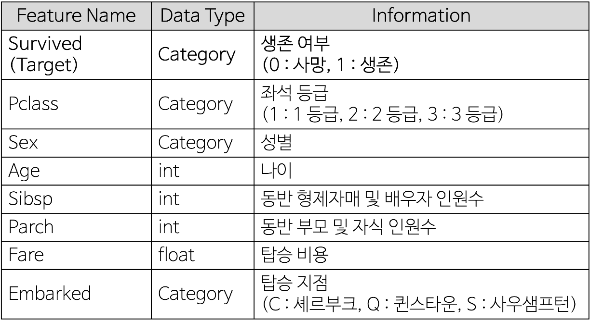

<span style = "color : blue">Create. Seung-Ho Ryu (Comment. Jung-In Seo)</span>

<details>
    <summary>Reference</summary>

- 파이썬 머신러닝 완벽 가이드(Chapter 4-5)

</details>
**< 실습 데이터셋 >**

- Titanic 데이터 셋 : 타이타닉 사건(1912년도) 때 타이타닉 호에 탑승했던 승객들의 정보, 생존 여부등으로 총 11개의 Feature로 이루어져 있습니다.
    - 11개의 변수 중 분석에 사용할 변수는 아래의 표에서 소개를 합니다.



- Flow Chart


# Data Preprocessing 
import pandas as pd
import numpy as np
from sklearn.model_selection import train_test_split, cross_val_score, StratifiedKFold
from sklearn.preprocessing import StandardScaler, LabelEncoder

# Visualization 
import seaborn as sns
import matplotlib.pyplot as plt

# warning ignore 
import warnings
warnings.filterwarnings(action = 'ignore')

# Model Definition
from sklearn.ensemble import AdaBoostClassifier

# Evaluation
from sklearn.metrics import roc_curve, accuracy_score, confusion_matrix, roc_auc_score
# 1. 데이터 불러오기
# 데이터 불러오기
titanic = pd.read_csv('./Data/Titanic.csv')

titanic
# 2. 전처리
# 가족 변수 추가
titanic['FamSize'] = titanic['SibSp'] + titanic['Parch']  # FamSize = 형제 및 배우자 수 + 부모님 및 자녀 수

# 분석에 사용할 변수만 선택
Use_Columns = ['Survived', 'Pclass', 'Sex', 'Age', 'FamSize', 'Fare', 'Embarked']  
titanic = titanic[Use_Columns] 

# 결측값 제거
titanic.dropna(subset = ['Age'], axis = 0, inplace = True)

# 변수 형태 변경
titanic[['Survived', 'Pclass', 'Sex', 'Embarked']] = titanic[['Survived', 'Pclass', 'Sex', 'Embarked']].astype('category')
titanic['Age'] = titanic['Age'].astype('int')

# One-Hot-Encoding
titanic = pd.get_dummies(titanic, columns = ['Pclass', 'Sex', 'Embarked'], drop_first = True)
# 3. 데이터 탐색
# 변수 형태
titanic.info()
# 수치형 변수 시각화
def numberic_plot(df, target):
    g = sns.PairGrid(df, hue = target)  # 주어진 데이터 컬럼에 대한 모든 조합을 만들어주는 빈 틀을 위한 코드        
    g.map_diag(sns.histplot)            # 삼각행렬의 중간 부분
    g.map_lower(sns.scatterplot)        # 아래 부분
    
    # 상관 계수 행렬을 구하고 상관 계수 값 표시
    corr_matrix = df.corr()
    for i, j in zip(*plt.np.triu_indices_from(g.axes, k = 1)):                                        # np.triu_indices_from : 삼각행렬의 위쪽 삼각형의 인덱스 (k = 0 : 대각 행렬 포함, 1 : 제외)
        g.axes[i, j].annotate(f"corr : {corr_matrix.iloc[i, j]:.2f}",                                 # 상관계수
                              (0.5, 0.5), xycoords = "axes fraction", ha = 'center', va = 'center',   # 중앙 정렬
                              fontsize = 12,                                                          # 글자 크기
                              color = 'black')                                                        # 글자 색  
    g.add_legend()  # 범례 표시
    plt.show()

Columns = ['Age', 'FamSize', 'Fare', 'Survived']  # 수치형 변수
numberic_plot(titanic[Columns], 'Survived')
# 4. 데이터 분할
# 생존 여부 변수를 Target으로 지정
y = titanic['Survived']

# 나머지 변수들을 예측 변수로 지정
X = titanic.drop(['Survived'], axis = 1)

# 75 : 25로 데이터 분할
X_train, X_test, y_train, y_test = train_test_split(X, y, test_size = 0.25, random_state = 0)
# 5. 에이다 부스트(AdaBoost)
```Python
from sklearn.ensemble import AdaBoostClassifier

# 에이다 부스트(Ada Boost) 모형 정의(파라미터 기본값)
AdaBoostClassifier(
    base_estimator = None,              # 기본 분류기 지정
    n_estimators = 50,                  # 기본 분류기의 개수
    learning_rate = 1.0,                # 학습률
    algorithm = 'SAMME.R',              # 분류기의 학습 알고리즘 지정
    random_state = None                 # 고정값
)
```

<details>
    <summary>Parameters</summary>


    
</details>
## 5-1. 모형 정의
# 에이다 부스트(Ada Boost) 모형 정의
AdaB = AdaBoostClassifier(
    base_estimator = None,  # 기본 분류기 지정
    n_estimators = 50,      # 기본 분류기의 개수
    learning_rate = 1.0,    # 학습률
    algorithm = 'SAMME.R',  # 분류기의 학습 알고리즘 지정
    random_state = 0        # 고정값
)
## 5-2. 모형 훈련
# Ada Boost 기본 모형 훈련
AdaB.fit(X_train, y_train)
### 5-2-1. 변수 중요도
# 피처 중요도 가져오기
feature_importance = AdaB.feature_importances_
# 정렬
indices = np.argsort(feature_importance)[::-1]
# 피처 이름
feature_names = X_train.columns

# 피처 중요도 시각화
plt.bar(range(X_train.shape[1]), feature_importance[indices], align = "center")
plt.xticks(range(X_train.shape[1]), feature_names[indices], rotation = 45)
plt.xlabel("Feature Index")
plt.ylabel("Feature Importance")
plt.title("AdaBoost Feature Importance")
plt.show()
## 5-3. 모형 평가
AdaB_pred = AdaB.predict(X_test)
AdaB_pred
### 5-3-1. Confusion Matrix


AdaB_cfx = confusion_matrix(y_test, AdaB_pred)                         # Confusion Matrix(True, pred)
AdaB_sensitivity = AdaB_cfx[1, 1] / (AdaB_cfx[1, 0] + AdaB_cfx[1, 1])  # 민감도 계산
AdaB_specificity = AdaB_cfx[0, 0] / (AdaB_cfx[0, 0] + AdaB_cfx[0, 1])  # 특이도 계산

print(f"AdaB 정확도(accuracy) : {accuracy_score(y_test, AdaB_pred) * 100 :.2f}%")
print(f"AdaB Confusion_Matrix :\n{AdaB_cfx}")
print(f"AdaB 민감도(sensitivity) : {AdaB_sensitivity * 100 :.2f}%")
print(f"AdaB 특이도(specificity) : {AdaB_specificity * 100 :.2f}%")
### 5-3-2. ROC 곡선
AdaB_pred = AdaB.predict(X_test)

fpr, tpr, thresholds = roc_curve(y_test, AdaB_pred)

J = tpr - fpr
ix = np.argmax(J)             # 가장 큰 원소의 위치(최대값의 인덱스)
best_thresh = thresholds[ix]

#plot roc and best threshold
sens, spec = tpr[ix], 1 - fpr[ix]

# plot the roc curve for the model
plt.plot([0,1], [0,1], linestyle = '--', markersize = 0.01, color = 'black')  # 중간 기준 선
plt.plot(fpr, tpr, marker = '.', color = 'black', markersize = 0.01, label = "Ridge AUC = %.2f" % roc_auc_score(y_test, AdaB_pred))
plt.scatter(fpr[ix], tpr[ix], marker = '+', s = 100, color = 'r', 
            label = f"Best threshold = {best_thresh:.3f}, \nSensitivity = {sens:.3f}, \nSpecificity = {spec:.3f}")

# axis labels
plt.xlabel("False Positive Rate(1 - Specificity)")
plt.ylabel("True Positive Rate(Sensitivity)")
plt.legend(loc = 4)

# show the plot
plt.show()